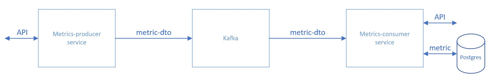

# App monitoring
Система мониторинга

## Стэк
Java 17, Maven, Spring Boot 3, Spring Data, PostgreSQl, Kafka, JUnit, Mockito, TestContainers

## Структура


## API

### 1. metrics-producer service

URL: http://localhost:8080

- POST /metrics - создать метрику

Подробнее: http://localhost:8080/swagger-ui/index.html

### 2. metrics-consumer service

URL: http://localhost:8090

- GET /metrics/{id} - получить метрику по id
- GET /metrics - получить список всех метрик

Подробнее: http://localhost:8090/swagger-ui/index.html

## Зависимости

- Zookeeper: http://localhost:2181

- Kafka: http://localhost:9092


## Сборка и запуск
1. Скопируйте репозиторий:
```Bash
git clone https://github.com/OrlovDeniss/app-monitoring.git
```
2. Перейдите в каталог проекта:
```Bash
cd app-monitoring
```
3. Используйте docker-compose для запуска зависимостей Zookeeper и Kafka:
```Bash
docker-compose up
```
4. Перейдите в каталог metrics-producer:
```Bash
cd metrics-producer
```
5. Скомпилируйте исходные файлы metrics-producer:
```Bash
mvn clean package
```
6. Запустите metrics-producer из папки target:
```Bash
java -jar metrics-producer-0.0.1-SNAPSHOT.jar
```
7. Повторите пункты 4-6 для metrics-consumer.